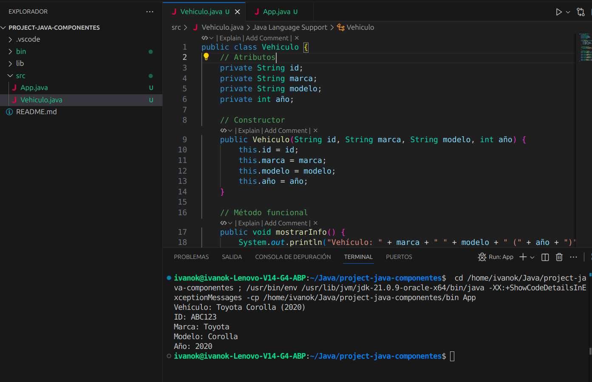
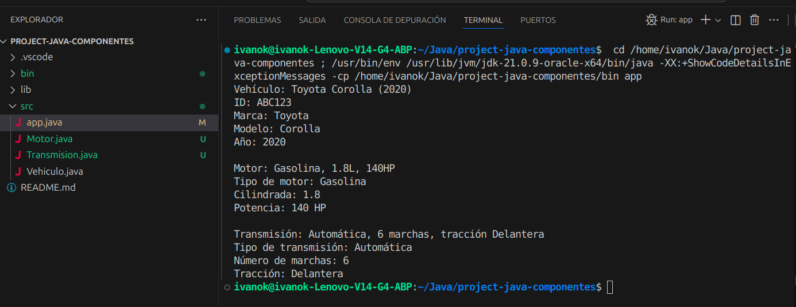
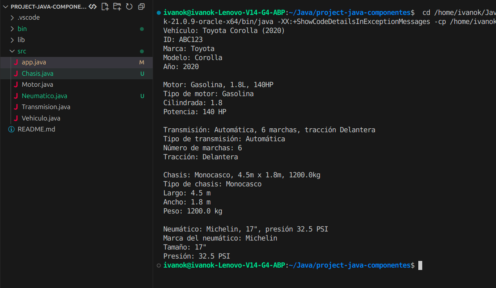
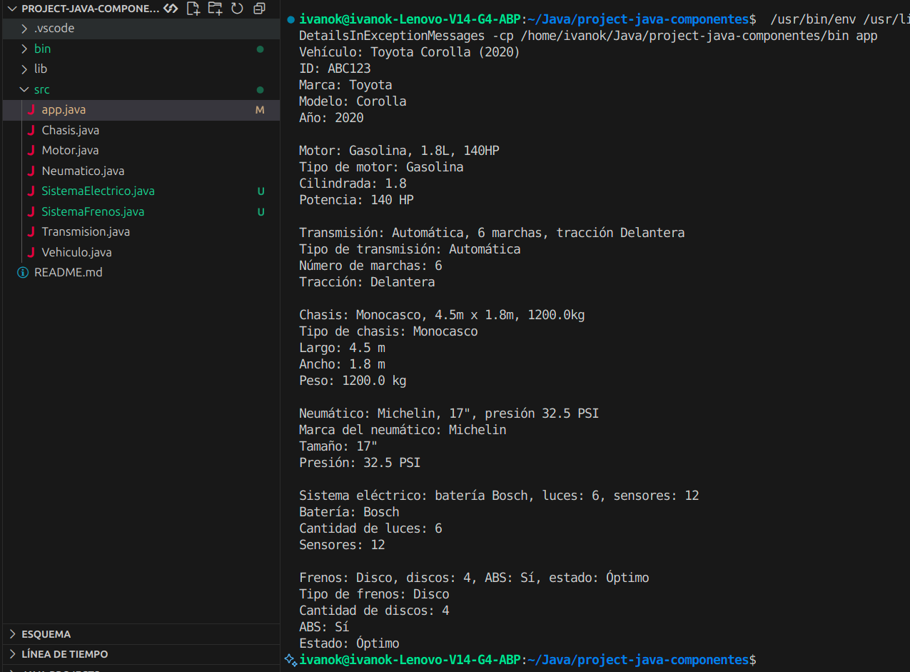
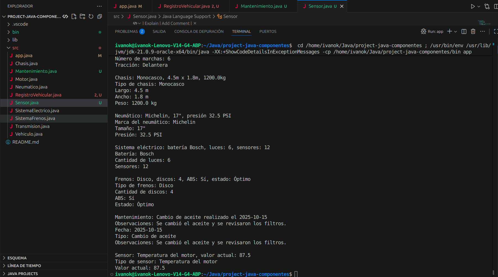

project-java-componentes.
Descripción de las clases y sus relaciones
Este proyecto implementa un conjunto de clases que representan los componentes principales de un vehículo. Cada clase modela una parte específica, con atributos, constructor, métodos funcionales y getters/setters. Las clases están diseñadas de forma independiente, pero pueden integrarse mediante composición en una clase superior como VehiculoCompleto si se desea escalar el diseño.
Clases implementadas

Clase	Descripción
Vehiculo	Representa el vehículo base: ID, marca, modelo, año.
Motor	Describe el motor: tipo, cilindrada, potencia.
Transmision	Modela la transmisión: tipo, número de marchas, tipo de tracción.
Chasis	Contiene información estructural: tipo, dimensiones, peso.
Neumatico	Representa una llanta: marca, tamaño, presión.
SistemaElectrico	Describe el sistema eléctrico: batería, luces, sensores.
SistemaFrenos	Información sobre frenos: tipo, discos, ABS, estado.
RegistroVehicular	Datos legales: matrícula, propietario, fecha de registro.
Mantenimiento	Historial de mantenimiento: fecha, tipo, observaciones.
Sensor	Modela un sensor individual: tipo, valor actual.

Relación entre clases
Actualmente, las clases están desacopladas y se instancian de forma independiente en la clase App.java. Sin embargo, se pueden relacionar mediante composición, agrupando instancias dentro de una clase contenedora como VehiculoCompleto.

Ejecución en App.java
La clase App se utiliza para instanciar y probar cada clase individualmente, mostrando sus atributos mediante métodos como mostrarInfo() o mostrarDatos().

